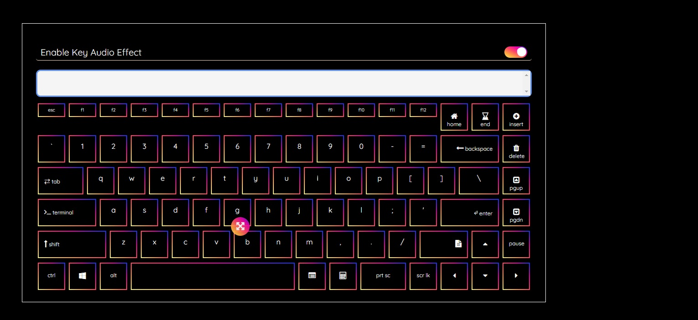

# Remote Keyboard

An old project I worked on for having a good understanding on JQuery and of course for fun 😁.


## How does it look like?



## How do I run?

Execute `run.sh` after cloning the repo. You must have `python3` installed in your system to start a local server. I used `bash` as shell script interpreter.

```bash
cd remote_keyboard
sudo chmod u+x run.sh
./run.sh
```

Or,

```bash
cd remote_keyboard
python3 -m http.server 8080 # for windows user, use python command
python3 -m webbrowser -t "http://localhost:8080/index.html" # for windows user, use python command
```

However you can also run the `index.html` as a standalone file in your browser.
